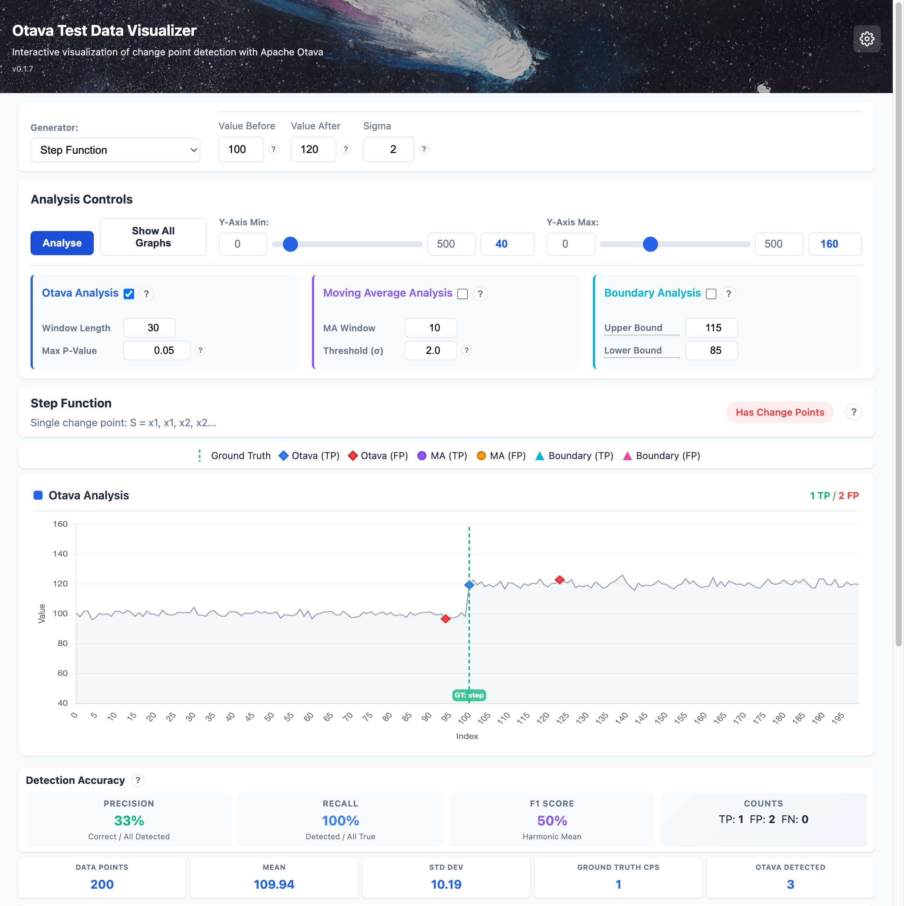
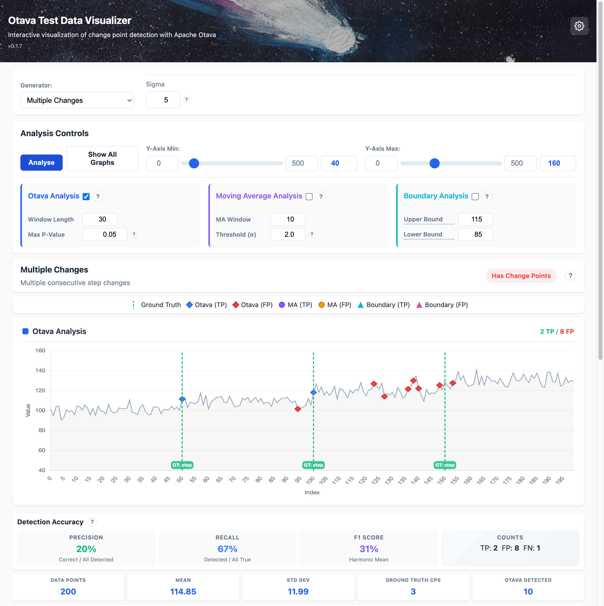
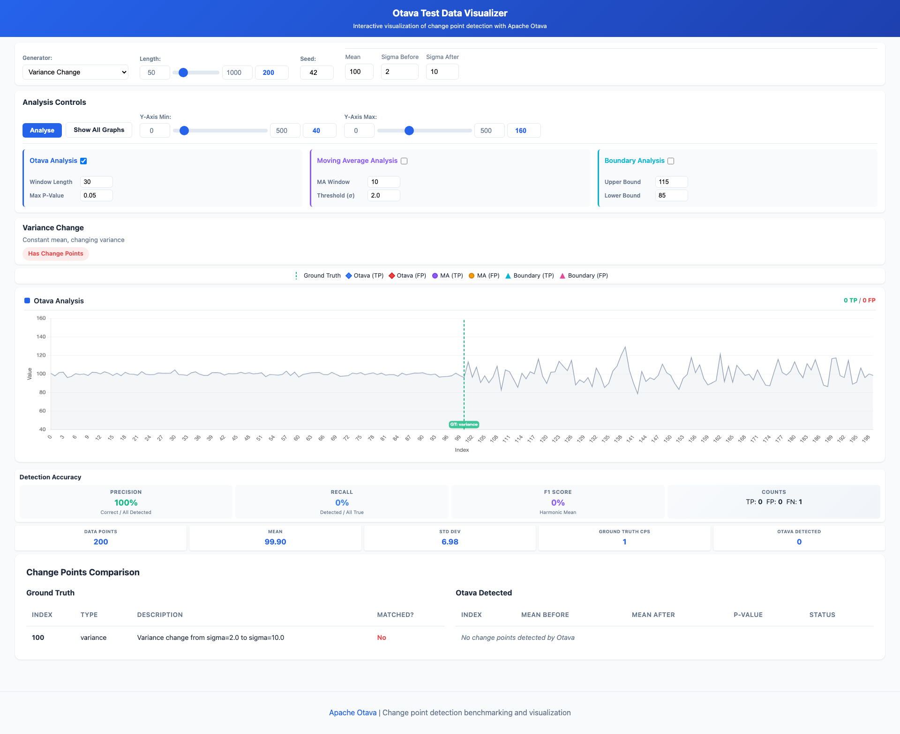

# Otava Test Data

Test data generators and Visualization for [Apache Otava](https://github.com/apache/otava) change point detection.

## Web Visualizer

The package includes an interactive web visualizer for exploring test patterns and comparing change point detection results against ground truth.



**Features:**
- Generate and visualize 17 different test patterns
- Compare three analysis methods: Otava (statistical), Moving Average, and Boundary detection
- View accuracy metrics (precision, recall, F1 score)
- Adjust parameters in real-time and see results instantly
- Tutorial mode with detailed explanations for all generators and methods

### Multiple Change Points

Detect multiple successive changes in your data:



### Variance Changes

Detect changes in data volatility even when the mean stays constant:



### Starting the Visualizer

```bash
pip install otava-test-data[web]

# Start the web server
otava-web
# Or with invoke tasks
inv web-start
```

Then open http://127.0.0.1:8100 in your browser.

## Installation

```bash
pip install otava-test-data
```

Or with all optional dependencies:

```bash
pip install otava-test-data[all]
```

## Quick Start

```python
from otava_test_data import step_function, noise_normal, combine

# Generate a step function (single change point) with realistic noise
step = step_function(length=500, value_before=100, value_after=120)
noise = noise_normal(length=500, mean=0, sigma=5)
combined = combine(step, noise)

# Export to CSV for Otava analysis
combined.to_csv("test_data.csv")

# Access ground truth change point information
for cp in combined.change_points:
    print(f"Change at index {cp.index}: {cp.description}")
```

## Available Generators

### Basic Building Blocks

| Generator | Description |
|-----------|-------------|
| `constant` | Constant value: `S = x, x, x, x...` |
| `noise_normal` | Normal distribution: `S ~ N(mean, sigma)` |
| `noise_uniform` | Uniform distribution: `S ~ U(min, max)` |
| `outlier` | Single anomaly: `S = x, x, x', x, x...` |
| `step_function` | Single change point: `S = x1, x1, x2, x2...` |
| `regression_fix` | Temporary regression: `S = x1, x2, x1...` |

### Advanced Patterns

| Generator | Description |
|-----------|-------------|
| `banding` | Oscillation between two values |
| `variance_change` | Constant mean, changing variance |
| `phase_change` | Phase shift in periodic signal |
| `multiple_changes` | Multiple consecutive step changes |

## CLI Tool

```bash
# Generate test suite
otava-gen generate --output-dir ./test_data --lengths 50 500 --seed 42

# List available generators
otava-gen list

# Get info about a generator
otava-gen info step_function
```

## Contents

```{toctree}
:maxdepth: 2

visualizer
generators
api
benchmark
development
```
