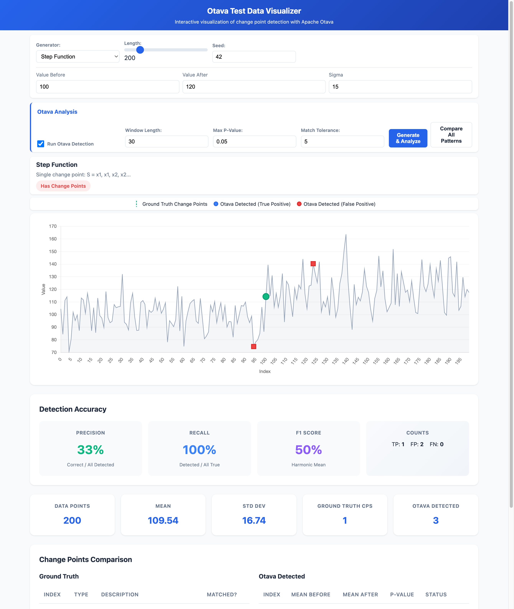
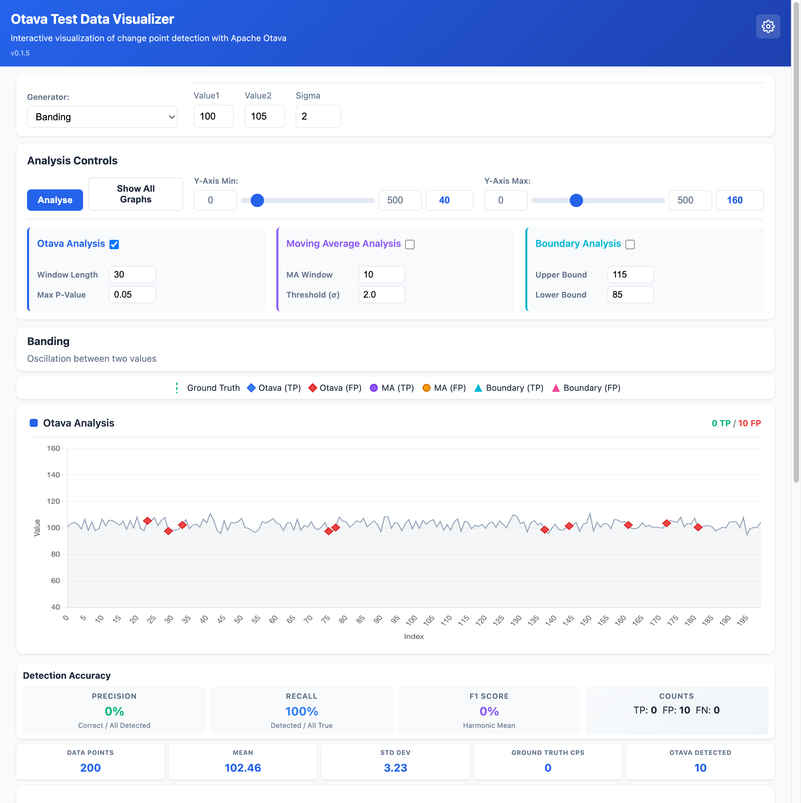
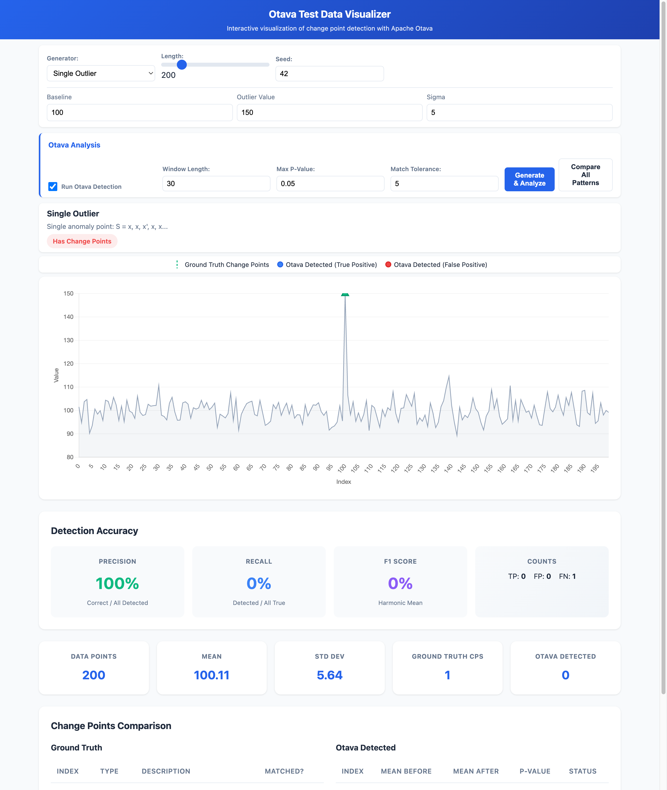
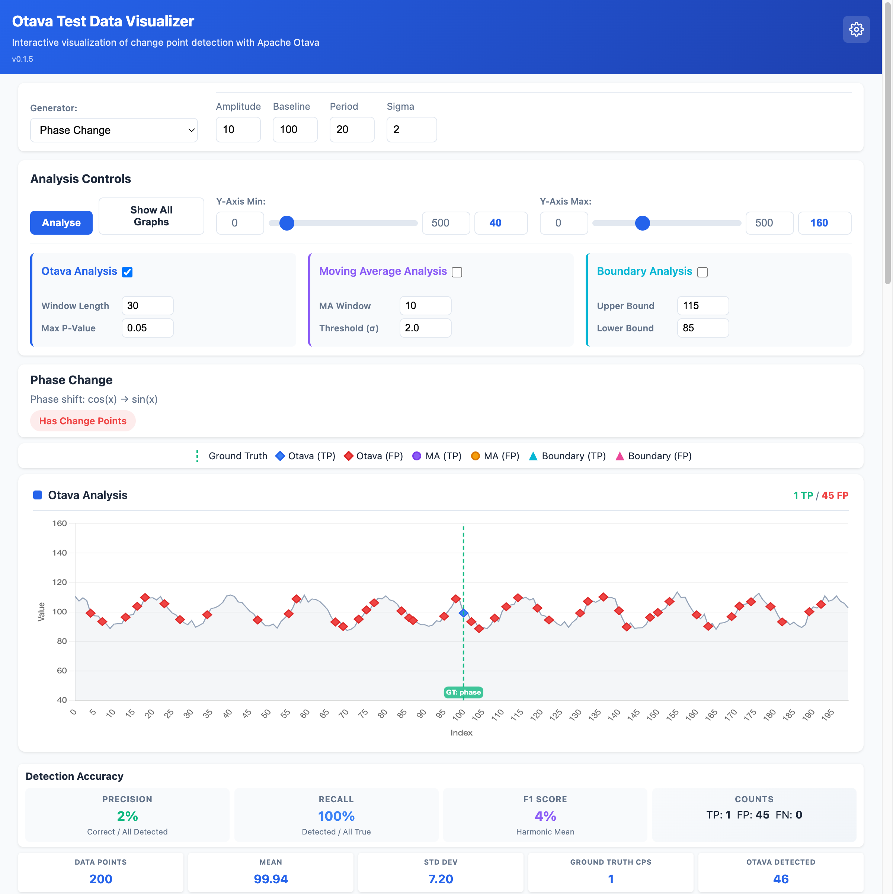
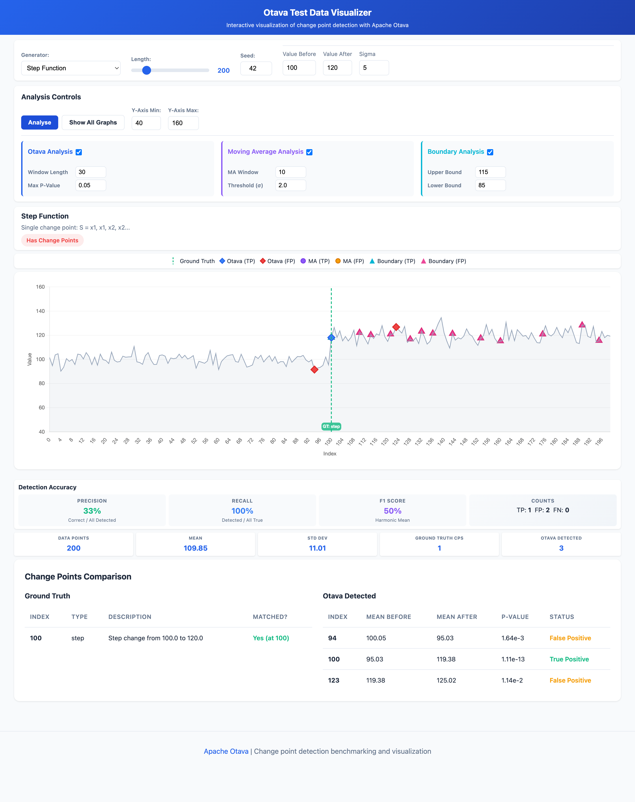
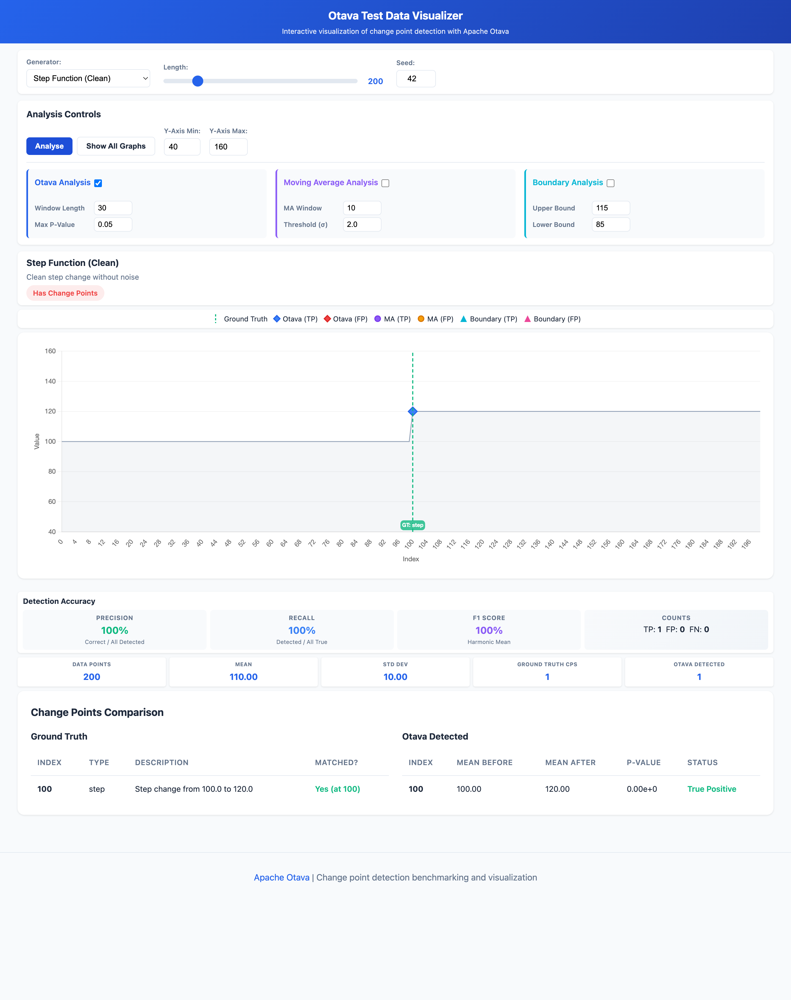

# Web Visualizer

The otava-test-data package includes an interactive web visualizer for exploring test patterns and comparing Otava's detection results against ground truth.

## Starting the Visualizer

```bash
# Start the web server in background
inv web-start

# Or run in foreground
inv web --port 8100

# Check server status
inv web-status

# Stop the server
inv web-stop
```

Then open http://127.0.0.1:8100 in your browser.

## Interface Overview

The visualizer provides:

- **Generator Selection**: Choose from 12 different test pattern generators
- **Parameter Controls**: Adjust generator-specific parameters
- **Otava Analysis**: Run change point detection and view results
- **Accuracy Metrics**: Compare detected vs ground truth change points

## Common Parameters

These parameters appear across multiple generators:

### Length

The total number of data points in the generated time series. Use longer series (500+) to give Otava more context for detection.

- **Range**: 50 - 1000
- **Default**: 200

### Seed

Random seed for reproducible generation. Using the same seed with the same parameters will produce identical results.

- **Default**: 42

### Sigma (Standard Deviation)

The standard deviation of Gaussian (normal) noise added to the signal. This is one of the most important parameters as it affects how easily Otava can detect change points.

**Low sigma (e.g., 2)**: Clean signal with minimal noise. Change points are easy to detect visually and statistically.


**High sigma (e.g., 15)**: Noisy signal. Change points become harder to detect, more similar to real-world performance data.



## Generator-Specific Parameters

### Step Function

Generates a single change point where the signal steps from one value to another.

| Parameter | Description | Default |
|-----------|-------------|---------|
| Value Before | Signal value before the change point | 100 |
| Value After | Signal value after the change point | 120 |
| Change Point | Index where the step occurs | Middle of series |
| Sigma | Noise standard deviation | 5 |

**Use case**: Simulates a performance regression or improvement that persists.

### Variance Change

Signal with constant mean but changing variance (spread of noise).

| Parameter | Description | Default |
|-----------|-------------|---------|
| Mean | Constant signal mean | 100 |
| Sigma Before | Standard deviation before change | 2 |
| Sigma After | Standard deviation after change | 10 |


**Use case**: Simulates a system becoming more unstable or erratic without mean shift.

### Multiple Changes

Multiple consecutive step changes creating a staircase pattern.

| Parameter | Description | Default |
|-----------|-------------|---------|
| Sigma | Noise standard deviation | 5 |


The generator creates 3 evenly-spaced step changes, each increasing by 10 units.

**Use case**: Simulates multiple successive performance regressions.

### Banding

Oscillation between two distinct values, creating a banded pattern.

| Parameter | Description | Default |
|-----------|-------------|---------|
| Value1 | First band value | 100 |
| Value2 | Second band value | 105 |
| Sigma | Noise standard deviation | 2 |



**Use case**: Simulates bimodal performance (e.g., alternating between two configurations).

### Single Outlier

A single anomalous point in an otherwise constant signal.

| Parameter | Description | Default |
|-----------|-------------|---------|
| Baseline | Normal signal value | 100 |
| Outlier Value | Value of the anomaly | 150 |
| Sigma | Noise standard deviation | 5 |



**Use case**: Simulates a one-time spike or glitch in performance data.

### Phase Change

Periodic signal (sine wave) with a phase shift at the change point.

| Parameter | Description | Default |
|-----------|-------------|---------|
| Amplitude | Wave amplitude | 10 |
| Baseline | Center value of oscillation | 100 |
| Period | Number of points per cycle | 20 |
| Sigma | Noise standard deviation | 2 |



**Use case**: Simulates subtle timing changes in periodic behavior.

### Regression + Fix

Temporary regression that gets fixed - signal drops then recovers.

| Parameter | Description | Default |
|-----------|-------------|---------|
| Value Before | Original performance | 100 |
| Regression Value | Value during regression | 80 |
| Value After | Value after fix | 100 |
| Sigma | Noise standard deviation | 5 |

**Use case**: Simulates a bug that causes regression and is later fixed.

### Constant

Constant value with no change points (baseline for comparison).

| Parameter | Description | Default |
|-----------|-------------|---------|
| Value | Constant signal value | 100 |

**Use case**: Verify that Otava doesn't produce false positives on stable data.

### Normal Noise

Pure Gaussian noise with no underlying signal.

| Parameter | Description | Default |
|-----------|-------------|---------|
| Mean | Center of distribution | 100 |
| Sigma | Standard deviation | 10 |

**Use case**: Test behavior on random noise without change points.

### Uniform Noise

Uniformly distributed random values.

| Parameter | Description | Default |
|-----------|-------------|---------|
| Min | Minimum value | 90 |
| Max | Maximum value | 110 |

**Use case**: Test with non-Gaussian noise distribution.

## Analysis Methods

The visualizer supports three different analysis methods for detecting change points. Each method has different strengths and is suited to different types of data patterns.



### Otava Analysis (Statistical)

**What it does**: Otava uses statistical hypothesis testing to find points where the data distribution changes significantly. It compares the data before and after each potential change point using statistical tests.

**Best for**: Detecting genuine shifts in the average (mean) value of your data, such as performance regressions or improvements that persist over time.



#### Parameters

| Parameter | Default | What it means |
|-----------|---------|---------------|
| **Window Length** | 30 | How many data points to look at on each side of a potential change point. Think of it like looking 30 points backward and 30 points forward to decide if something changed. |
| **Max P-Value** | 0.05 | How confident Otava needs to be before reporting a change. Lower values (like 0.01) mean "only report changes I'm very sure about" - fewer false alarms but might miss subtle changes. Higher values (like 0.1) mean "report anything that looks suspicious" - catches more changes but may include false positives. |

**Understanding P-Value**: The p-value is like a confidence score, but inverted. A p-value of 0.05 means "there's only a 5% chance this apparent change is just random noise." Scientists commonly use 0.05 as a threshold - anything below it is considered statistically significant.

**Tips for tuning**:
- If Otava is missing obvious changes: try increasing Max P-Value to 0.1
- If Otava is reporting too many false changes: try decreasing Max P-Value to 0.01
- For noisy data: increase Window Length to 50 or more
- For detecting rapid successive changes: decrease Window Length to 15-20

---

### Moving Average Analysis (Trend-Based)

**What it does**: This method calculates a rolling average of your data and flags points where the actual value deviates significantly from this average. It's looking for points that "break the trend."

**Best for**: Detecting sudden spikes or drops that stand out from the recent trend. Good for finding outliers and sudden anomalies.

#### Parameters

| Parameter | Default | What it means |
|-----------|---------|---------------|
| **MA Window** | 10 | The number of recent data points used to calculate the moving average. A window of 10 means "average the last 10 points to get the expected value." |
| **Threshold (σ)** | 2.0 | How many standard deviations away from the moving average a point must be to be flagged. The symbol σ (sigma) represents standard deviation - a measure of typical variation. |

**Understanding the Threshold**: If your data typically varies by ±5 units from its average, setting threshold to 2σ means "flag anything more than 10 units away from expected." A threshold of 3σ would require 15+ units deviation.

**Tips for tuning**:
- For stable data with occasional anomalies: use smaller MA Window (5-10) and lower threshold (1.5-2.0)
- For volatile data: use larger MA Window (15-30) and higher threshold (2.5-3.0)
- To catch subtle shifts: lower the threshold
- To reduce false positives: raise the threshold

---

### Boundary Analysis (Threshold-Based)

**What it does**: The simplest method - it checks if data points cross predefined upper or lower boundaries. Any point outside these boundaries is flagged as a potential change point.

**Best for**: Monitoring against known acceptable ranges. Useful when you have specific performance thresholds that should not be crossed (e.g., "response time must stay below 200ms").

#### Parameters

| Parameter | Default | What it means |
|-----------|---------|---------------|
| **Upper Bound** | 115 | Any data point above this value will be flagged. Think of it as your "maximum acceptable value." |
| **Lower Bound** | 85 | Any data point below this value will be flagged. Think of it as your "minimum acceptable value." |

**Tips for tuning**:
- Set bounds based on your actual performance requirements
- For the default test data (mean around 100): bounds of 85-115 will catch significant deviations
- Tighter bounds catch more violations but may flag normal variation
- Wider bounds only catch severe anomalies

---

## Comparing Analysis Methods

| Method | Strength | Weakness | Best Use Case |
|--------|----------|----------|---------------|
| **Otava** | Statistically rigorous, finds true distribution changes | May miss gradual changes, requires tuning | Production monitoring, A/B testing |
| **Moving Average** | Good at finding outliers, adapts to trends | Can miss sustained shifts | Anomaly detection, spike detection |
| **Boundary** | Simple, predictable, fast | Needs known thresholds, misses relative changes | SLA monitoring, compliance checking |

**Recommendation**: Start with Otava for general change point detection. Add Moving Average if you need to catch outliers. Use Boundary Analysis when you have specific threshold requirements.

### Match Tolerance

When comparing detected vs ground truth change points, how many indices apart can they be and still count as a match.

- **Default**: 5
- **Effect**: Allows for slight positional inaccuracy in detection.

## Accuracy Metrics

The visualizer calculates these metrics when comparing Otava's results to ground truth:

- **Precision**: Of all detected change points, what fraction are correct?
- **Recall**: Of all true change points, what fraction were detected?
- **F1 Score**: Harmonic mean of precision and recall
- **True Positives (TP)**: Correctly detected change points
- **False Positives (FP)**: Incorrectly flagged non-change-points
- **False Negatives (FN)**: Missed true change points

## Show All Graphs

Click "Show All Graphs" to run analysis on all generators simultaneously. This produces a grid of charts showing how well the analysis methods perform across different types of change point patterns, allowing you to quickly compare detection accuracy across pattern types.
